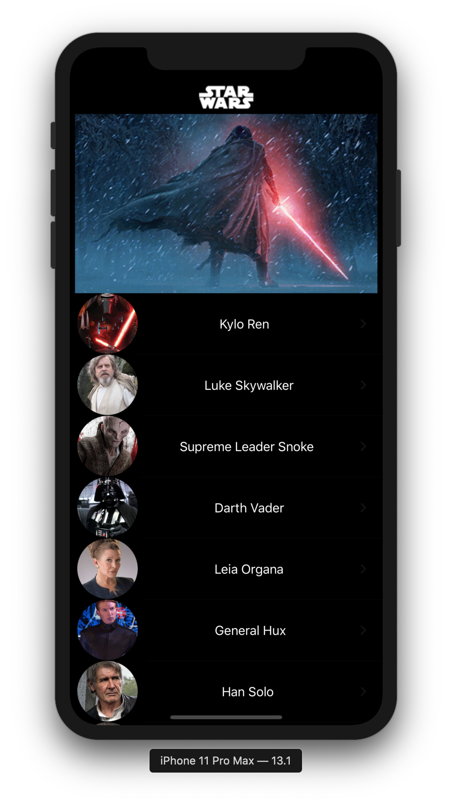

# Listy

Requirements

- Create an iOS app that retrieves a list of individuals from a REST web service call and add these individuals to a local datastore within the app. The URL of the web service is: https://edge.ldscdn.org/mobile/interview/directory
- Display the individual profile image in the table view (image URL is provided in the web service data)
- Create a profile detail view that you can get to by tapping on an individual in the list

## Compatability
Swift ver: **Swift 5**  
deployment target: **iOS 13.1**  
device: **iPhone**  
orientation: **Portrait**  
The requirements don't specify anything about the device compatibility or orientation so I'm doing iPhone in portrait mode to keep things simple.

## Technologies

URLSession https://developer.apple.com/documentation/foundation/urlsession

NotificationCenter https://developer.apple.com/documentation/foundation/notificationcenter

Grand Central Dispatch https://developer.apple.com/documentation/DISPATCH

Core Data https://developer.apple.com/documentation/coredata?changes=_7

## Third Party Libraries

FLAnimatedImage: https://github.com/Flipboard/FLAnimatedImage

## Flow

1. The app will start on the "MainTableViewController".
2. On viewDidLoad a call to a web service will fetch data and display it on a tableview.
3. Upon tapping on a cell, a "ProfileDetailTableViewController" will be pushed onto the navigation stack and display details about the selected individual.

